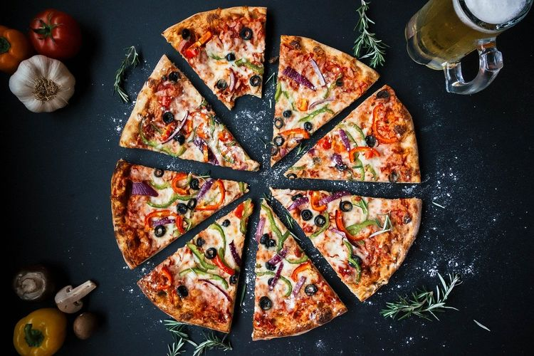
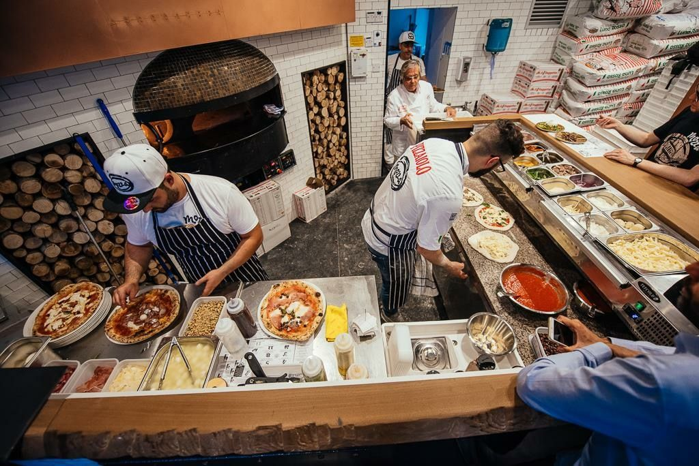

<style>
body {
text-align: justify}
</style>

```{r setup, include=TRUE}
# clear-up the environment
rm(list = ls())

# chunk options
knitr::opts_chunk$set(
  message = FALSE,
  warning = FALSE,
  fig.align = "center",
  comment = "#>"
)
```

<style>
body {
text-align: justify}
</style>

# Pendahuluan

Artikel ini dibuat untuk memenuhi tugas Learning by Building (LBB) pada materi **DV - Data Visualization**. Materi berikut ditujukan untuk semua orang yang tertarik pada bidang Data Science dan R-Language secara umum. Materi ini dipersilahkan untuk direproduksi, didistribusikan, diterjemahkan, atau diadaptasikan sesuai dengan kebutuhan pembaca. 

Penulis tertarik mengangkat topik tentang **Pizza Sales** karena penulis mendapatkan referensi dataset yang dirasa cukup lengkap untuk diolah dan ini cukup menarik karena penulis juga menyukai dan sering menikmati Pizza, dan ingin mengetahui bagaimana trend penjualan Pizza terjadi. Dalam hal ini penulis mencoba *role-playing* sebagai Data Consultant/Analyst di sebuah Toko Pizza bernama **El-Capitan Pizza Resto**.

Selain itu, data analysis dan data visualization untuk sebuah pertanyaan bisnis sangat cocok untuk material yang berkaitan dengan penjualan (sales), maka dari itu pemilih memilih untuk mengolah dataset ini untuk dijadikan material tugas di **Algoritma : Data Visualization Course**. 

```{r, out.width = "60%", echo = TRUE, fig.align = "center"}

```

Artikel ini bertujuan untuk eksplorasi data dan visualisasi data dari penjualan berbagai jenis Pizza di sebuah toko. Susunan dari artikel ini terdiri dari metodologi untuk proses analisa data diantaranya : Seleksi Dataset, Data Cleaning dan Pre-Processing, Eksplorasi Data, dan Visualisasi Data. 

Setiap langkah dari metodologi ini akan diikuti oleh penjelasan yang dijabarkan oleh Penulis untuk memperjelas maksud dan tujuan dari setiap langkah yang dilakukan. Selain itu juga dapat bermanfaat untuk pembaca ketika ingin mencoba memulai belajar untuk mengolah sebuah dataset.

# Import Data dan Pre-Processing

Pada bagian ini, Penulis akan coba menjabarkan proses pengambilan data dan proses awal apa saja yang harus dilakukan agar sebuah dataset siap untuk dianalisa.

## Import Library

Penulis akan menggunakan beberapa library pada Artikel ini. Berhubung dataset dan artikel ini kemungkinan akan dikembangkan untuk Tugas LBB yang lainnya, penulis akan mengupload library yang akan digunakan pada materi selanjutnya sehingga dokumen lebih *futureproof*.

```{r}
# load library
options(scipen = 99) #me-non-aktifkan scientific annotation
library(tidyverse) #koleksi beberapa library R
library(dplyr) #grammar of data manipulation
library(readr) #membaca data
library(ggplot2) #plot statis
library(plotly) #plot interaktif
library(glue) #setting tooltip
library(lubridate) #treatment date column
library(scales) # mengatur skala pada plot
library(readxl) #import data excel
```


## Import dan Cek Data

Data ditaruh pada folder **data_input** pada working directory dimana file R Markdown penulis tempatkan.

```{r}
#import Dataset
pizza_sales <- read_excel("data_input/datamodel-pizzasales.xlsx", sheet = "pizza_sales")

#glimpse Dataset
glimpse(pizza_sales)
```

Deskripsi Kolom :

* **'order_details_id '** : Order Details ID untuk Tiap Transaksi per Jenis Pizza
* **'order_id'** : Order ID per Transaksi
* **'pizza_id'** : ID Jenis/Tipe Pizza
* **'quantity'** : Jumlah Pizza yang dipesan 
* **'order_date'** : Tanggal Pemesanan
* **'order_time'** : Jam Pemesanan
* **'unit_price'** : Harga Tiap Pizza
* **'total_price'** : Total Harga -> Harga Tiap Pizza x Jumlah Pizza yang dipesan
* **'pizza_size   '** : Ukuran Pizza 
* **'pizza_category'**  : Kategori Pizza
* **'pizza_ingredients'** : Bahan Baku Pizza untuk Topping 
* **'pizza_name'**  : Nama Produk Pizza  

Berdasarkan glimpse di atas, ada beberapa kolom yang perlu diganti jenisnya untuk memudahkan processing data.

## Cleansing Data

Pada bagian ini, Penulis akan melakukan beberapa pengecekan yang umum dilakukan pada sebuah dataset sebelum memulai proses data analisis seperti cek ukuran data awal, cek missing value, cek tipe data pada kolom. Lalu setelah itu, Penulis melakukan treatment untuk berbagai kondisi yang ditemui pada dataset yang dicek.

```{r}
#cek ukuran data sebelum cleansing
nrow(pizza_sales)
```

```{r}
#cek missing value
colSums(is.na(pizza_sales))
```
```{r}
#cek jenis class untuk kolom pizza_ingredients
class(pizza_sales$pizza_ingredients[5])
```
Penulis merasa bahwa value di Column **"pizza_ingredients"** memiliki potensi untuk dianalisa, sehingga akan lebih mudah apabila Penulis mengkonversikan value tersebut menjadi data list agar memudahkan data processing

```{r}
#converting value di column 'pizza_ingredients' menjadi list

pizza_sales$pizza_ingredients <- lapply(strsplit(as.character(pizza_sales$pizza_ingredients),
                                                 "[][']|,\\s*"), function(x) x[nzchar(x)])
class(pizza_sales$pizza_ingredients[5])
```

```{r}
pizza_sales$pizza_ingredients[5]
```

```{r}
#mengganti jenis kolom
pizza_sales_clean <-
  pizza_sales %>%
  mutate(
    unit_price = as_factor(unit_price),
    pizza_size = as_factor(pizza_size),
    pizza_category = as_factor(pizza_category),
    pizza_name = as_factor(pizza_name)
  )
glimpse(pizza_sales_clean)
```
```{r}
#cek ukuran data
nrow(pizza_sales_clean)
```
Data sudah dianggap **'clean'** dan bisa digunakan untuk proses selanjutnya yaitu data analisis.

# Eksplorasi Data dan Visualisasi Data

Untuk memudahkan proses Eksplorasi dan Visualisasi Data, Penulis membuat beberapa pertanyaan bisnis dengan *role-playing* lagi menjadi seorang Pemilik Bisnis. Pada kasus ini, dataset adalah berupa penjualan **'Pizza'** setiap harinya di **Tahun 2015**. Sebagai pemilik bisnis, penulis ingin mengetahui beberapa pertanyaan untuk menyusun strategi bisnis di tahun depan.

Pertanyaan Bisnis di **EL-Capitan Pizza Resto**

- **1. Bagaimana kesimpulan penjualan Pizza berdasarkan Menu ?**
- 1.A - Summary Penjualan Pizza berdasarkan Nama Pizza
- 1.B - Summary Penjualan Pizza berdasarkan Size Pizza
- 1.C - Summary Penjualan Pizza berdasarkan Kategori Pizza

Pemilik Bisnis bisa menentukan strategi marketing yang tepat untuk tahun depan.

- **2. Bagaimana penjualan Pizza terhadap waktu?**
- 1.A - Penjualan Pizza terhadap Bulan
- 1.B - Penjualan Pizza terhadap Hari
- 1.C - Penjualan Pizza terhadap Jam

Pemilik Bisnis bisa menentukan strategi jam kerja, hari libur, periode cuti yang efektif dan efisien untuk para karyawan dan secara bisnis.

- **3. Menu Pizza apakah yang paling menguntungkan?**

Pemilik Bisnis bisa menentukan besaran profit margin untuk Menu tertentu.

- **4. Bagaimana Pemakaian Bahan Baku di El-Capitan Pizza Resto?**

Pemilik Bisnis bisa memprediksi untuk trend pembelian stok bahan baku Pizza dalam satu tahun

```{r, out.width = "60%", echo = TRUE, fig.align = "center"}

```

## Penjualan Pizza berdasarkan Jenis Menu

Penulis membagi penjualan menjadi beberapa plot sebagai berikut.

### Penjualan Pizza berdasarkan Nama

```{r}
#agregasi data
pizza_sales_name <-
  pizza_sales_clean %>%
  group_by(pizza_name) %>%
  summarise(total_pizza_sales = sum(quantity)) %>%
  ungroup() %>%
  arrange(desc(total_pizza_sales)) %>%
  mutate(label = glue("Total : {comma(total_pizza_sales)}
                      Name : {pizza_name}"))
pizza_sales_name
```

```{r, echo=FALSE,results='hide',fig.keep='all'}
#plotting data
plot_sales_name <- 
  ggplot(data = pizza_sales_name,
                          mapping = aes(x = total_pizza_sales,
                                        y = reorder(pizza_name, total_pizza_sales),
                                        text = label)) + 
  geom_col(aes(fill = total_pizza_sales), show.legend = FALSE) +
  scale_fill_gradient(low = "yellow", high = "red") +
  labs(
    title = "Sales by Product",
    y = "Pizza Name",
    x = "Sales (Whole Round of Pizza)"
  )
  theme_minimal()
plot_sales_name 
```

### Penjualan Pizza berdasarkan Size

```{r}
#agregasi data
pizza_sales_size <-
  pizza_sales_clean %>%
  group_by(pizza_size) %>%
  summarise(total_pizza_sales = sum(quantity)) %>%
  ungroup() %>%
  mutate(label = glue("Total : {comma(total_pizza_sales)}
                      Name : {pizza_size}")) %>%
  mutate(percentage = total_pizza_sales/sum(total_pizza_sales))
pizza_sales_size
```
```{r, echo=FALSE,results='hide',fig.keep='all'}
#plotting data
plot_sales_size <- 
  ggplot(data = pizza_sales_size,
                          mapping = aes(x = total_pizza_sales,
                                        y = reorder(pizza_size, total_pizza_sales),
                                        text = label)) + 
  geom_col(aes(fill = total_pizza_sales), show.legend = FALSE) +
  scale_fill_gradient(low = "yellow", high = "red") +
  labs(
    title = "Sales by Size",
    y = "Size",
    x = "Sales (Whole Round of Pizza)"
  )
  theme_minimal()
plot_sales_size
```

### Penjualan Pizza berdasarkan Kategori

```{r}
#agregasi data
pizza_sales_cat <-
  pizza_sales_clean %>%
  group_by(pizza_category) %>%
  summarise(total_pizza_sales = sum(quantity)) %>%
  ungroup() %>%
  arrange(desc(total_pizza_sales)) %>%
  mutate(label = glue("Total : {comma(total_pizza_sales)}
                      Name : {pizza_category}")) 
pizza_sales_cat
```

```{r, echo=FALSE,results='hide',fig.keep='all'}
#plotting data
plot_sales_cat <- 
  ggplot(data = pizza_sales_cat,
                          mapping = aes(x = total_pizza_sales,
                                        y = reorder(pizza_category, total_pizza_sales),
                                        text = label)) + 
  geom_col(aes(fill = total_pizza_sales), show.legend = FALSE) +
  scale_fill_gradient(low = "yellow", high = "red") +
  labs(
    title = "Sales by Size",
    y = "Size",
    x = "Sales (Whole Round of Pizza)"
  )
  theme_minimal()
plot_sales_cat
```

### Insight

Penulis menarik beberapa insight sebagai saran untuk strategi bisnis dari sisi Menu Pizza yang ditawarkan di Restoran Pizza

* Untuk menu **The Brie Carrie Pizza** sebaiknya dipromosikan agar penjualan bertambah karena merupakan Menu yang paling kurang diminati oleh Pelanggan
* Untuk size **XXL** bisa dihapus apabila tidak begitu menguntungkan dari sisi bisnis karena penjualan sangat sedikit, atau dipromosikan apabila ingin memperkuat lini produk bisnis.

## Penjualan Pizza berdasarkan Waktu

Penulis membagi penjualan menjadi berdasarkan Bulan, Hari, dan Jam.

### Penjualan berdasarkan Bulan

```{r}
#membuat kolom baru untuk jenis bulan
pizza_sales_clean$month_sales <- month(pizza_sales_clean$order_date, 
                                       label = TRUE)

#agregasi jumlah penjualan pizza tiap bulan
pizza_month_sales <- 
  pizza_sales_clean %>%
  group_by(month_sales) %>%
  summarise(total_pizza = sum(quantity)) %>% 
  ungroup() %>%
  arrange(month_sales) %>%
  mutate(label = glue("Month : {month_sales}
                      Total Pizza : {comma(total_pizza)}"))
pizza_month_sales
```
```{r, echo=FALSE,results='hide',fig.keep='all'}
# ggplot
pizza_month_lineplot <- 
  ggplot(pizza_month_sales, 
         mapping = aes(x = month_sales,
                       group = 1,
                       text = label
                       )
         ) +
  geom_line(aes(y = total_pizza,
                colour = "total_pizza"),
            size = 1,
            show.legend = FALSE
            ) +
  geom_point(aes(y = total_pizza),
             size = 2,
             color = "red"#,
             #text = text
             ) +
  scale_y_continuous(labels = comma,
                     breaks = seq(3500,4500,100),
                     limits = c(3500, 4500)
                     ) +
  labs(
    title = "Sales By Month",
    y = "Total Sales (Whole Round of Pizza)",
    x = "Month"
  )
  theme_minimal()

pizza_month_lineplot
```

### Penjualan berdasarkan Hari

```{r}
#membuat kolom baru untuk jenis hari
pizza_sales_clean$day_sales <- wday(pizza_sales_clean$order_date, label = TRUE)

#agregasi jumlah penjualan pizza tiap hari
pizza_day_sales <- 
  pizza_sales_clean %>%
  group_by(day_sales) %>%
  summarise(total_pizza = sum(quantity)) %>% 
  ungroup() %>%
  arrange(day_sales) %>%
  mutate(label = glue("Day : {day_sales}
                      Total Pizza : {comma(total_pizza)}"))
pizza_day_sales
```
```{r, echo=FALSE,results='hide',fig.keep='all'}
# ggplot
pizza_day_lineplot <- 
  ggplot(pizza_day_sales, 
         mapping = aes(x = day_sales,
                       group = 1,
                       text = label
                       )
         ) +
  geom_line(aes(y = total_pizza,
                colour = "total_pizza"),
            size = 1,
            show.legend = FALSE
            ) +
  geom_point(aes(y = total_pizza),
             size = 2,
             color = "red"#,
             #text = text
             ) +
  scale_y_continuous(labels = comma,
                     breaks = seq(5000,10000,1000),
                     limits = c(5000, 10000)
                     ) +
  labs(
    title = "Sales By Day",
    y = "Total Sales (Whole Round of Pizza)",
    x = "Day"
  )
  theme_minimal()

pizza_day_lineplot
```

### Penjualan berdasarkan Jam

```{r}
#membuat kolom baru untuk jam penjualan
pizza_sales_clean$hour_sales <- hour(pizza_sales_clean$order_time)

#agregasi jumlah penjualan pizza per jam
pizza_hour_sales <- 
  pizza_sales_clean %>%
  group_by(hour_sales) %>%
  summarise(total_pizza = sum(quantity)) %>% 
  ungroup() %>%
  arrange(hour_sales) %>%
  mutate(label = glue("Hour : {hour_sales}
                      Total Pizza : {comma(total_pizza)}"))
pizza_hour_sales
```
```{r, echo=FALSE,results='hide',fig.keep='all'}
# ggplot
pizza_hour_lineplot <- 
  ggplot(pizza_hour_sales, 
         mapping = aes(x = hour_sales,
                       group = 1,
                       text = label
                       )
         ) +
  geom_line(aes(y = total_pizza,
                colour = "total_pizza"),
            size = 1,
            show.legend = FALSE
            ) +
  geom_point(aes(y = total_pizza),
             size = 2,
             color = "red"#,
             #text = text
             ) +
  scale_y_continuous(labels = comma,
                     breaks = seq(0,8000,500),
                     limits = c(0, 8000)
                     ) +
  scale_x_continuous(breaks = seq(0,24,1)
                     ) +
  labs(
    title = "Sales By Hour",
    y = "Total Sales (Whole Round of Pizza)",
    x = "Hour"
  )
  theme_minimal()

pizza_hour_lineplot
```

### Insight

Penulis menarik beberapa insight sebagai saran untuk strategi pengaturan tenaga kerja di Restoran

* Untuk bulan **Februari**, **September**, **Oktober** merupakan bulan dengan penjualan paling rendah sehingga untuk perizinan cuti karyawan bisa lebih dilonggarkan pada bulan-bulan tersebut.
* Untuk jadwal hari libur dapat dilakukan di Hari **Minggu** dan **Senin** karena penjualan pada kedua hari tersebut relatif rendah dibandingkan dengan penjualan di hari lainnya
* Dengan asumsi awal jam masuk kerja di **Jam 8** dan persiapan Toko adalah **1 jam**, akan lebih efektif apabila jam masuk kerja di geser ke **Jam 9** dan Toko dibuka **Jam10** karena penjualan di Jam 9 sangat amat sedikit.
* Untuk **Jam Istirahat** pekerja dapat dilakukan paling banyak secara bergantian untuk tiap karyawan pada **Jam 14** hingga **Jam 15** karena pada jam tersebut penjualan relatif menurun dibandingkan dua **Peak-Hour** yaitu Jam Makan Siang : **Jam 12** dan Jam Makan Malam : **Jam 17 - Jam 18**

## Menu Pizza paling menguntungkan

Menu Pizza dengan volume penjualan paling tinggi belum tentu menjadi Menu Pizza yang paling menguntungkan, karena nilai profit dihitung berdasarkan profit margin dimana harga penjualan dikurangi dengan harga pokok produksi (harga bahan baku + harga proses). Dalam hal ini, Penulis mencoba membandingkan volume penjualan dengan total uang yang dihasilkan oleh tiap Menu.

Asumsi Awal : **Prosentase Margin Profit untuk Tiap Menu Sama**

```{r}
#agregasi data menjadi proporsi agar bisa dikomparasi
pizza_sales_profit <-
  pizza_sales_clean %>%
  group_by(pizza_name) %>%
  summarise(total_pizza_sales = sum(quantity), total_pizza_grossprofit = sum(total_price)) %>%
  ungroup() %>%
  arrange(desc(total_pizza_sales)) %>%
  mutate(volume_percentage = total_pizza_sales / sum(total_pizza_sales), 
         grossprofit_percentage = total_pizza_grossprofit / sum(total_pizza_grossprofit)) %>%
  mutate(label = glue("Total Sales : {comma(total_pizza_sales)}
                      Total Profit : {comma(total_pizza_grossprofit)}
                      Name : {pizza_name}"))
pizza_sales_profit
```

```{r}
plot_sales_profit <-
  ggplot(pizza_sales_profit) +
  geom_bar(aes(x = volume_percentage,
               y = reorder(pizza_name, volume_percentage),
               colour = "Sales Volume",
               text = label), stat = "identity", fill = "red") +
  geom_point(aes(x = grossprofit_percentage, 
                y = reorder(pizza_name, volume_percentage),
                colour = "Total Gross Profit",
                text = label), stat = "identity", fill = "cyan", size = 2) +
  labs(title = "Sales Volume vs Total Gross Profit",
       x = "Percentage", y = "Pizza Name") +
  theme_minimal()
plot_sales_profit

```
Dari plot diatas, dapat dilihat bahwa Volume Penjualan tidak selalu berdampak pada Besaran Profit. Berdasarkan data ini penulis mencoba mencari Menu yang Undervalue (Volume Tinggi, Profit Rendah) dan Menu overvalue (Volume Rendah, Profit Tinggi)

Penulis membuat kolom baru bernama **'value'** yang diambil dari **'grossprofit_percentage'** dibagi **'volume_percentage'**. Apabila nilai lebih dari 1 maka bisa dibilang menu tersebut Overvalue, nilai kurang dari 1 maka undervalue.

```{r}
#membuat kolom value
value_sales_profit <-
  pizza_sales_profit %>%
  mutate(value = grossprofit_percentage / volume_percentage) %>%
  arrange(desc(value)) %>%
  select(pizza_name,value, total_pizza_sales)
```
```{r}
#mencari menu overvalue
head(value_sales_profit, 5)
```

```{r}
#mencari menu undervalue
tail(value_sales_profit, 10)
```


### Summary

* Untuk menu **The Brie Carre Pizza** sangat overvalue, dan mungkin bisa jadi penyebab volume penjualan sangat sedikit dibandingkan jenis menu yang lain. Hal ini bisa ditingkatkan dengan promosi dan penurunan harga untuk meningkatkan penjualan Menu tersebut.

* Untuk Menu **The Big Meat Pizza**, **The Pepperoni Pizza**, **The Hawaiian Pizza** sangat undervalue dengan volume penjualan yang sangat tinggi, ini bisa dimanfaatkan dengan meningkatkan prosentase profit margin untuk meningkatkan *NET PROFIT* bagi Restoran.

## Bahan Baku yang digunakan di Tahun 2015

Penulis memanfaatkan kolom **'pizza_ingredients'** yang telah penulis konversi menjadi List untuk selanjutnya digunakan untuk Analisis.

```{r}
tail(pizza_sales_clean)
```

```{r}
#pembuatan dataframe
ingredient_data <-
  pizza_sales_clean %>%
  select(order_date, order_time, order_id, quantity, pizza_ingredients, pizza_name) 
```

```{r}
#agregasi data untuk menghitung total jumlah bahan baku
ingredient_total <-
  ingredient_data %>%
  tidyr::unnest_longer(pizza_ingredients) %>%
  group_by(pizza_ingredients) %>%
  summarise(n = sum(quantity)) %>%
  arrange(desc(n)) %>%
  mutate(label = glue("Total Item : {comma(n)}
                      Pizza Name : {pizza_ingredients}"))

ingredient_total
```
Data ini bisa dikalikan dengan proporsi bahan baku per pizza, karena di Dataframe tidak tersedia, Penulis asumsikan value nya = 1 di setiap Pizza.

```{r, echo=FALSE,results='hide',fig.keep='all'}
#plotting data
plot_tot_ingredient_top <- 
  ggplot(data = head(ingredient_total, 30),
                          mapping = aes(x = n,
                                        y = reorder(pizza_ingredients, n),
                                        text = label)) + 
  geom_col(aes(fill = n), show.legend = FALSE) +
  scale_fill_gradient(low = "yellow", high = "red") +
  labs(
    title = "Ingredient Usage Top 30",
    y = "Ingredient Name",
    x = "Quantity"
  ) +
  scale_x_continuous(labels = comma,
                     breaks = seq(0,30000,5000),
                     limits = c(0, 30000)) +
  theme_minimal()
plot_tot_ingredient_top
```
```{r, echo=FALSE,results='hide',fig.keep='all'}
#plotting data
plot_tot_ingredient_low <- 
  ggplot(data = tail(ingredient_total, 35)) + 
  geom_col(aes(x = n,
               y = reorder(pizza_ingredients, n),
               text = label), stat = "identity", fill = "yellow") +
  labs(
    title = "Ingredient Usage Low 35",
    y = "Ingredient Name",
    x = "Quantity"
  ) +
  scale_x_continuous(labels = comma,
                     breaks = seq(0,30000,5000),
                     limits = c(0, 30000)) +
  theme_minimal()
plot_tot_ingredient_low

```

### Summary

* Dari dua Plot diatas, dapat dilihat bahwa rempah-rempah seperti bawang, tomat, bawang merah, dan merica menempati tempat teratas pada jumlah bahan baku yang dipakai. Ini bisa dimanfaatkan oleh pemilik bisnis untuk menentukan pembelian dengan **volume besar** untuk mendapat **diskon** dari **Supplier**.

* Perlu diperhatikan untuk bahan baku dengan pembelian dibawah **2500 per Tahun** untuk memesan secara hati-hati dan melihat trend penjualan per hari agar **tidak overstock** dan bahan baku akhirnya tidak terpakai karena rusak.


# Referensi

1. [Kaggle Dataset : Pizza Sales](https://www.kaggle.com/datasets/shilongzhuang/pizza-sales)
2. [Stackoverflow : Convert to List in R](https://stackoverflow.com/questions/51640176/convert-column-as-character-into-list-type-with-r)
3. [Stackoverflow : Counting List](https://stackoverflow.com/questions/74212258/how-to-count-a-value-inside-a-list-that-contains-separated-comma-value-in-a-data)

